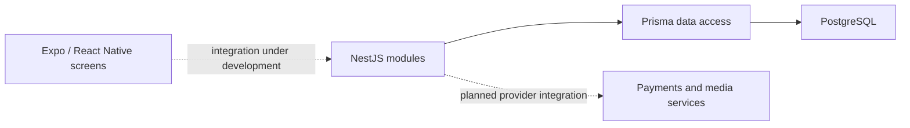

# PiggyCapsule

A shared-savings application prototype combining group goals, contribution records, and video-memory concepts. The repository contains a NestJS API and an Expo / React Native client.

## Implementation status

| Area | Current evidence |
| --- | --- |
| Authentication | Signup, login, OTP, JWT, and password hashing code |
| Group savings | Piggy-bank and membership modules |
| Contributions | Contribution records and memory-timeline queries |
| Payments | Provider initialization and verification are TODOs in the contribution service |
| Withdrawals | Request and approval models exist in the Prisma schema; a complete execution workflow is not established |
| Mobile client | Screens and mock data exist; end-to-end API integration needs verification |

This is not a production payment service. The earlier fixed-OTP example is not the current generator: the source generates a random six-digit value with `Math.random()`, which needs security review before real use.

## Architecture



## Repository structure

- [backend/src/auth](backend/src/auth) — authentication.
- [backend/src/piggy-banks](backend/src/piggy-banks) — group savings.
- [backend/src/contributions](backend/src/contributions) — contribution records.
- [backend/prisma/schema.prisma](backend/prisma/schema.prisma) — relational models.
- [mobile/app](mobile/app) — Expo Router screens.
- [mobile/src/data/mock.ts](mobile/src/data/mock.ts) — demonstration data.
- [backend/README.md](backend/README.md) — endpoint reference and backend setup details.

## Development setup

Install Node.js compatible with the declared NestJS, Prisma, and Expo versions. Use a disposable PostgreSQL database.

### API

```sh
cd backend
npm install
```

Copy `.env.example` to `.env` and configure your development database and JWT settings. Review `prisma.config.ts`, then generate the client and apply development migrations:

```sh
npx prisma generate
npx prisma migrate dev
npm run start:dev
```

These are the project's setup steps, not a report of a passing clean installation. The repository's Prisma 7 configuration and client initialization need compatibility verification. Do not use a production database.

### Mobile

In a separate terminal:

```sh
cd mobile
npm install
npm start
```

Follow Expo's local instructions for your simulator, device, or web target.

## Checks

The backend declares `npm test`, `npm run test:e2e`, and `npm run build`. Existing test files do not establish coverage of payment correctness, group authorization, or withdrawal behavior. The mobile package provides `android`, `ios`, and `web` launch scripts.

## Engineering limitations

Payment verification currently marks contributions complete without contacting the provider, and repeated calls can increment the balance again. Monetary fields use floating-point types. Review idempotency, atomic updates, authorization, money representation, and provider verification before using real funds.

Generated backend output is currently tracked under `backend/dist/`; it should not be treated as the authoritative implementation. Read `backend/src/`.

## Next improvements

Finish and test provider integrations, establish the mobile/API contract, harden authentication and payment transitions, use precise monetary representations, and make clean setup reproducible.

## Author

Tekena Ajuzieogu · [GitHub](https://github.com/CyberTekena)
